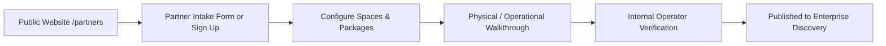

# Relatia Day 19 — Step 1: Public Website Audit, Partner Entry Point & Hospitality Funnel Foundation

## 1. Executive Summary

Day 19 Step 1 elevates Relatia's public-facing presence from an enterprise-skewed marketing site into a complete, dual-sided marketplace platform. Inspired by high-end architectural benchmarks like Ande (in navigation structure, clarity of pathways, and elevated aesthetic confidence), Relatia now clearly segments and serves two distinct audiences:
1. **Enterprise Corporate Clients** (EAs, Department Heads, Finance Directors, Event Planners seeking compliant, policy-governed dining and event management).
2. **Hospitality Partners** (Fine dining restaurants, luxury hotel dining rooms, private members' clubs, rooftop lounges, and banquet spaces seeking verified corporate demand with guaranteed budgets and zero no-show risk).

---

## 2. Public Website Audit Findings

Before implementation, a full audit of the existing marketing site was performed:

| Area | Prior State | Audit Assessment & Gap Identified | Solution Implemented in Day 19 Step 1 |
| :--- | :--- | :--- | :--- |
| **Top Navigation** | `Home`, `Platform`, `Partners`, `Contact`, `Sign In`, `Book a Demo` | Lacked explicit audience framing; "Partners" felt like a secondary brochure page; Sign In routed only to enterprise. | Segmented links: `For Enterprises`, `Platform`, `For Partners`, `Contact`. Added dual Sign-In modal/dropdown (Enterprise vs Partner Portal) and contextual CTAs (`List Your Venue` vs `Book a Demo`). |
| **Hero Section** | Single enterprise headline with "Book a Demo" / "See Platform" buttons. | Hospitality operators had no clear callout or entry point above the fold. | Added dedicated Hospitality Partner micro-callout immediately under hero CTAs linking directly to `/partners`. |
| **Homepage Architecture** | 9 sections focused almost exclusively on enterprise buyer ROI, approval workflow, and GST reconciliation. | Did not explain how venues join, what spaces qualify, or how quality is audited. | Enhanced `VenueSection` into a rich Hospitality Partner Ecosystem showcase with explicit operator quality gate callouts, space taxonomy, and direct CTAs. |
| **Partner Landing Page (`/partners`)** | Basic brochure with value metrics and an interactive demo intake form. | Lacked explanation of the 4-step onboarding journey, space taxonomy, what partners manage in their portal, and the operator review boundary before publishing. | Reworked with 8 comprehensive sections: Hero, Spaces Taxonomy (PDRs, Boardrooms, Terraces, Banquets), 4-Step Onboarding Journey, Management Toolkit, Partner Economics, Tiers & Curation Standards, Testimonials, and Intake Funnel. |
| **Partner Auth Scaffolding** | No `/partners/login` or `/partners/sign-up` routes existed. | Partner links routed generically or dead-ended. | Scaffolded dedicated, branded `/partners/login` and `/partners/sign-up` pages connecting to authentication and onboarding flows. |
| **Messaging Truth & Boundaries** | Risk of implying instant live table sync or automated AI booking. | Kept strictly grounded in real MVP capabilities. | Explicitly highlighted: rule-based deterministic matching, structured host briefs, physical operational audits, and operator-controlled publishing. |

---

## 3. Updated Information Architecture & Routes

```
Public Marketing Web
├── / (Homepage — For Enterprises)
│   ├── Hero (Enterprise OS + Partner Callout)
│   ├── Trust Benchmarks
│   ├── 6-Step Event Workflow
│   ├── Finance & GST SAC 996331 Engine
│   ├── Role-Based Stakeholder Value
│   ├── Intelligence Roadmap (Deterministic live, AI on roadmap)
│   ├── Hospitality Partner Ecosystem & Quality Gate
│   ├── Impact Benchmarks & Feedback
│   └── Dual Final CTA (Enterprise Demo / Partner Network)
│
├── /platform (Platform Architecture & Deep Walkthrough)
│   ├── State Engine Lifecycle
│   ├── 5 Core Pillars
│   ├── Enterprise Integration Suite
│   └── Security, Role Controls & GST Compliance
│
├── /partners (Hospitality Partner Network Landing Page)
│   ├── Hero (Fill PDRs with Verified Enterprise Accounts)
│   ├── Space Taxonomy (PDRs, Boardrooms, Lounges, Banquets)
│   ├── 4-Step Onboarding Journey
│   ├── Partner Management Toolkit (Spaces, Packages, Pricing, Visibility)
│   ├── Partner Economics (AOV, 0% No-Show Risk, Weekday PDR Utilization)
│   ├── Tiers & Physical Inspection Standards
│   ├── Hospitality Leadership Testimonials
│   └── Partner Application Intake Form
│
├── /partners/login (Hospitality Partner Portal Sign In)
├── /partners/sign-up (Hospitality Partner Account Registration)
├── /contact (Enterprise Executive Consultation & Live Demo Intake)
└── /sign-in (Enterprise Client Sign In)
```

---

## 4. Hospitality Partner Funnel & Onboarding Pathway

The public website now sets accurate expectations for how a hospitality partner enters and operates on Relatia:



### The 4-Step Onboarding Workflow
1. **Apply & Register Profile:** Submit property details, contact info, and tax identity (GSTIN).
2. **Catalog Spaces & Packages:** Configure bookable spaces (PDRs, boardrooms, rooftop terraces, banquet suites), capacities, set menus, dietary capabilities, and minimum spend rules.
3. **Operational Verification Audit:** Relatia's partner team conducts a physical or virtual walkthrough to verify acoustic privacy, service readiness, and compliance.
4. **Operator Review & Discovery Live:** Listing visibility is activated for enterprise planners only upon explicit operator verification and review. Joining does not automatically publish the venue.

---

## 5. Enterprise vs. Partner Pathway Decision Matrix

| Dimension | Enterprise Client Pathway | Hospitality Partner Pathway |
| :--- | :--- | :--- |
| **Primary Goal** | Streamline event requests, approvals, GST invoicing, and spend control | Monetize off-peak weekday capacity, secure corporate spend, eliminate no-shows |
| **Primary Discovery Route** | `/` (Homepage) and `/platform` | `/partners` |
| **Primary CTA** | `Book an Enterprise Demo` (`/contact`) | `Apply as a Partner` (`/partners#apply`) / `List Your Venue` |
| **Auth Entry Point** | `/sign-in` (Enterprise Client Sign In) | `/partners/login` & `/partners/sign-up` |
| **Managed Objects** | Event requests, approval workflows, budgets, invoices | Venue profile, bookable spaces, set menus/packages, minimum spends, cancellation rules |

---

## 6. Known Boundaries & Limitations in Step 1

1. **Partner Self-Serve Dashboard (Step 2+):**
   - Step 1 establishes the public entry points, landing pages, and auth scaffolding (`/partners/login`, `/partners/sign-up`).
   - The dedicated external provider portal dashboard UI where partners self-manage spaces/packages directly will be built in subsequent Day 19 steps.
2. **Deterministic Booking vs. Real-Time Table Sync:**
   - Messaging honestly reflects that bookings are structured enterprise requests coordinated through Relatia, not an instant live table API sync (e.g. OpenTable consumer model).
3. **Internal Operator Approval Gate:**
   - All public copy explicitly affirms that partner submissions require operational inspection before venues appear in `/venues` enterprise discovery.

---

## 7. Next Steps for Day 19

- **Day 19 Step 2:** Provider Portal Authentication, Session Management & Provider Workspace Setup.
- **Day 19 Step 3:** External Provider Venue, Space, and Package Self-Management Interface.
- **Day 19 Step 4:** Provider Verification State, Readiness Diagnostics, and Submission-for-Review Workflow.
